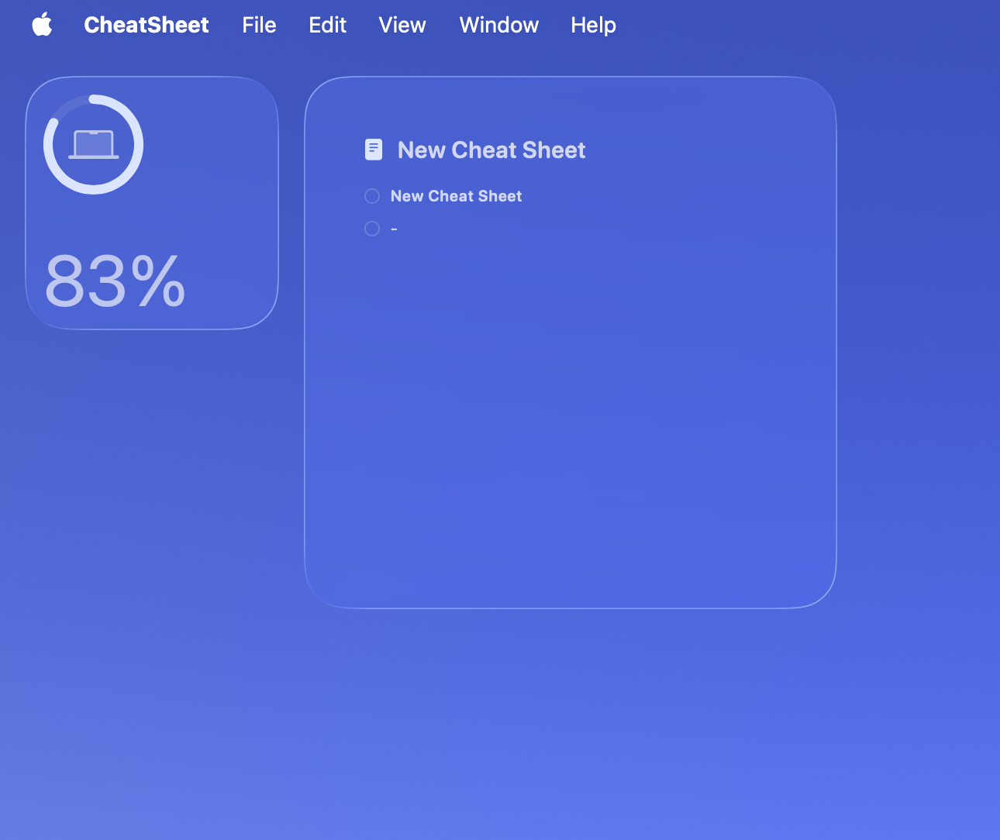
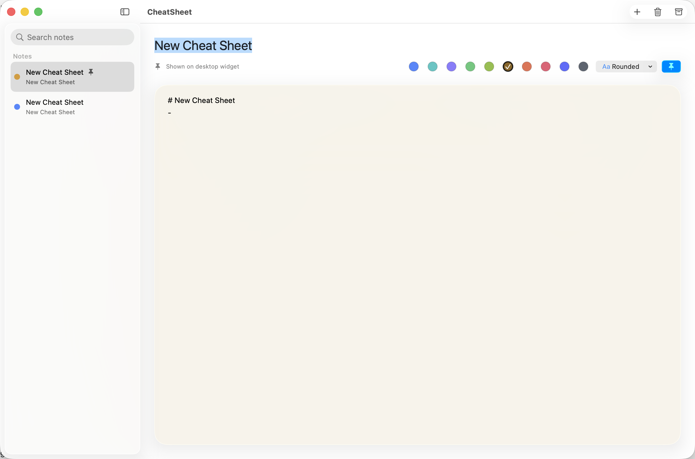
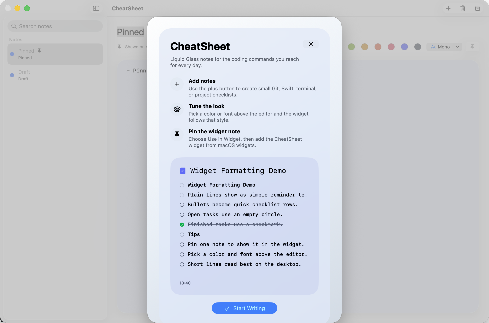
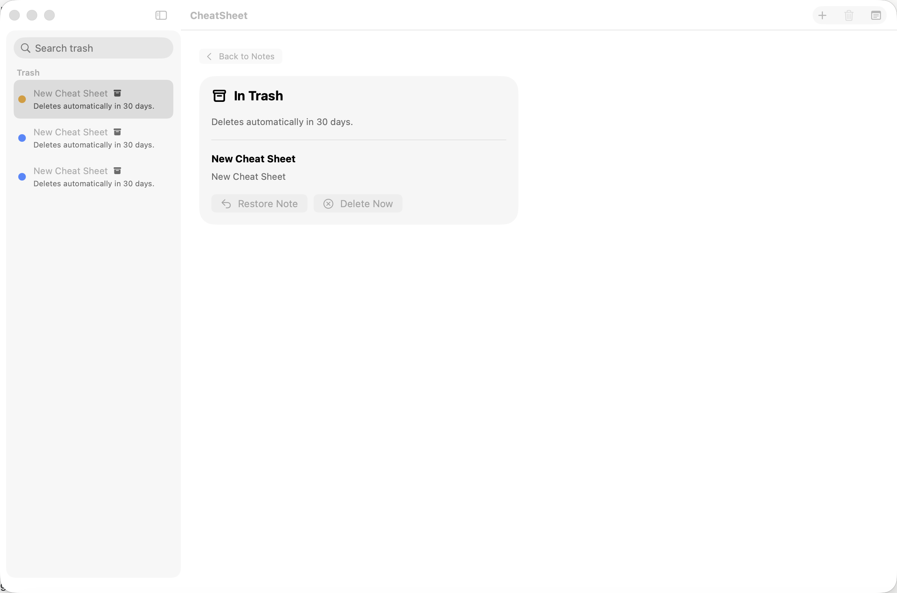
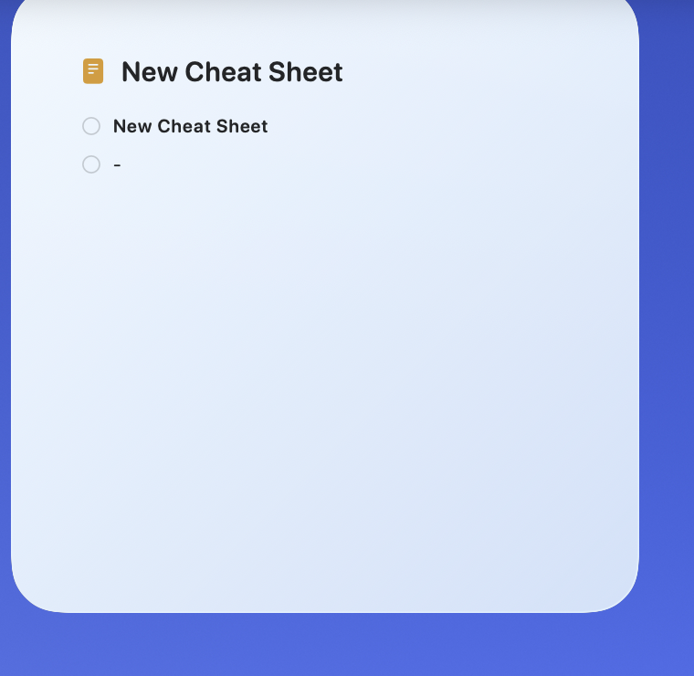
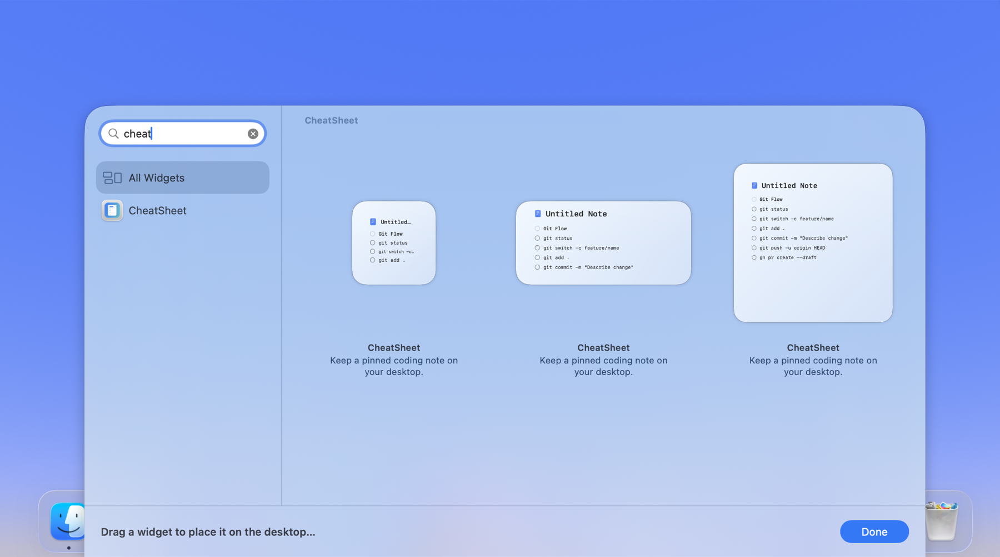

# CheatSheet

CheatSheet is a **100% free and open source** macOS, iOS, and iPadOS app for keeping short coding notes, checklists, and command reminders close by. It includes WidgetKit widgets so one pinned note can stay visible while you work.

## Screenshots













The app is intentionally simple:

- Create and edit small cheat-sheet notes.
- Pin one note for the WidgetKit widget on supported platforms.
- Pick a note color and font style.
- Move notes to Trash, restore them, or let them delete automatically after 30 days.
- Store notes locally using SwiftData and app-group persistence.
- Use Liquid Glass styling on macOS 26 with material fallbacks on macOS 15 through 25.

## Project Layout

```text
CheatSheetApp/       Shared SwiftUI app sources for macOS, iOS, and iPadOS
CheatSheetWidgets/   WidgetKit extension sources for macOS and iOS/iPadOS
Shared/              Shared model, parsing, storage, and persistence code
CheatSheetTests/     Swift Testing coverage
project.yml          XcodeGen project definition
```

`project.yml` is the source of truth for the Xcode project. The generated `CheatSheet.xcodeproj` is ignored by git.

## Requirements

- macOS 15 or later
- Xcode 26 or later
- XcodeGen

Install XcodeGen with Homebrew:

```sh
brew install xcodegen
```

## Build

Generate the project:

```sh
xcodegen generate
```

Build from the command line:

```sh
Scripts/verify-macos.sh
```

This runs arm64 and x86_64 tests, then builds a universal Release app. It generates
the Xcode project under `/private/tmp` because a checkout stored in a File
Provider-managed Documents folder can make `xcodebuild` block in
`NSFileCoordinator` while opening the generated project bundle.

For a single local build from a checkout outside File Provider-managed storage:

```sh
xcodegen generate
xcodebuild -project CheatSheet.xcodeproj -scheme CheatSheet -destination 'platform=macOS' -derivedDataPath .derivedData CODE_SIGNING_ALLOWED=NO build
```

Build and test the iOS/iPadOS app and widget:

```sh
xcodegen generate --spec project.yml
xcodebuild test -project CheatSheet.xcodeproj -scheme CheatSheetiOS -destination 'platform=iOS Simulator,name=iPhone 16' -derivedDataPath /tmp/CheatSheet-iOS-Test-DD CODE_SIGNING_ALLOWED=NO
xcodebuild build -project CheatSheet.xcodeproj -scheme CheatSheetiOS -destination 'platform=iOS Simulator,name=iPad Pro 11-inch (M4)' -derivedDataPath /tmp/CheatSheet-iPad-DD CODE_SIGNING_ALLOWED=NO
```

## Running The Widget

The app and widget share data through platform app groups. The current app groups are:

```text
macOS:      HD39MR492X.com.wesleykeetch.wesleycheatsheet
iOS/iPadOS: group.com.wesleykeetch.wesleycheatsheet
```

If you fork the project and want to run the widget with your own Apple Developer account, update the app group in these places:

- `project.yml`
- `CheatSheetApp/CheatSheet.entitlements`
- `CheatSheetApp/CheatSheet-iOS.entitlements`
- `CheatSheetWidgets/CheatSheetWidgets.entitlements`
- `CheatSheetWidgets/CheatSheetWidgets-iOS.entitlements`
- `Shared/Sources/CheatSheetNote.swift`

Then regenerate the project:

```sh
xcodegen generate
```

After running the app once, add the CheatSheet widget from the macOS widget gallery or the iOS/iPadOS widget picker. Pin a note in the app with `Use in Widget`, then the widget will read that note from the shared app group.

## Privacy

CheatSheet stores notes locally on device. The app does not include analytics, accounts, sync, or network services.

## Contributing

Contributions are welcome. Please keep the project small, native, and easy to understand.

Start with [CONTRIBUTING.md](CONTRIBUTING.md) for setup, style, and pull request guidance.

## License

CheatSheet is available under the MIT License. See [LICENSE](LICENSE) for details.
